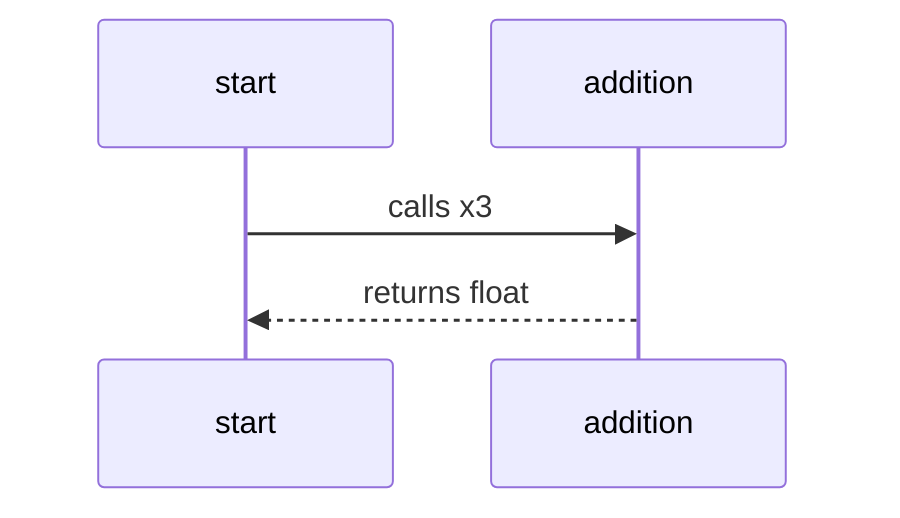
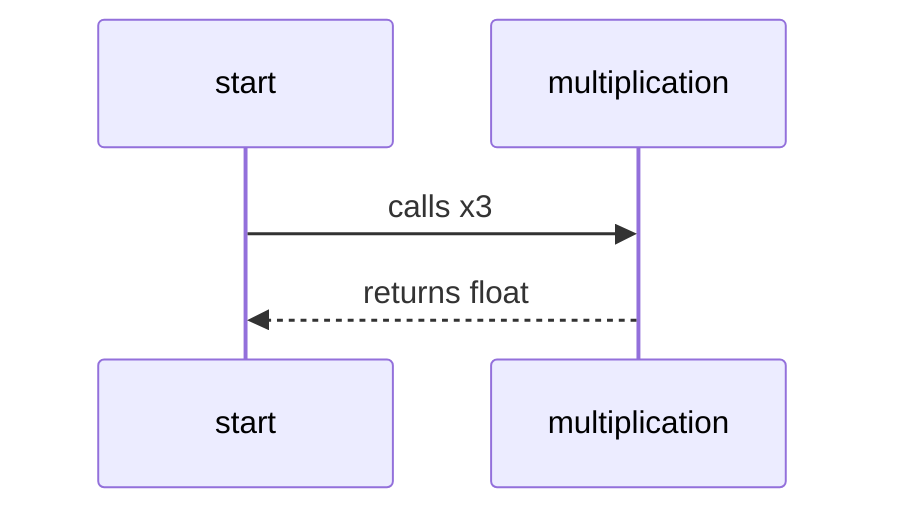
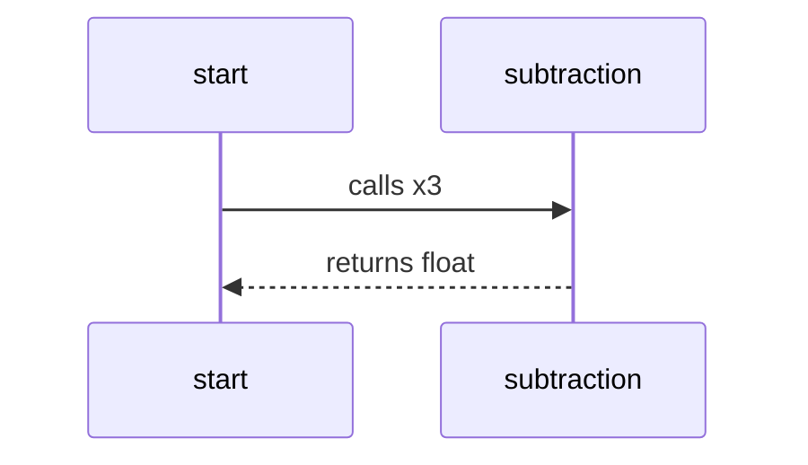

This is a mermaid diagram, you may need to install a [Browser Plugin](https://github.com/BackMarket/github-mermaid-extension) or [VsCode extension](https://marketplace.visualstudio.com/items?itemName=bierner.markdown-mermaid) or similar to view it.

You can also [view it full screen as an SVG](https://mermaid.ink/svg/c2VxdWVuY2VEaWFncmFtCiAgc3RhcnQtPj5hZGRpdGlvbjogY2FsbHMgeDMKICBhZGRpdGlvbi0tPj5zdGFydDogcmV0dXJucyBmbG9hdAo=)        

This is a mermaid diagram, you may need to install a [Browser Plugin](https://github.com/BackMarket/github-mermaid-extension) or [VsCode extension](https://marketplace.visualstudio.com/items?itemName=bierner.markdown-mermaid) or similar to view it.

You can also [view it full screen as an SVG](https://mermaid.ink/svg/c2VxdWVuY2VEaWFncmFtCiAgc3RhcnQtPj5kaXZpc2lvbjogY2FsbHMgeDMKICBkaXZpc2lvbi0tPj5zdGFydDogcmV0dXJucyBmbG9hdAo=)        

This is a mermaid diagram, you may need to install a [Browser Plugin](https://github.com/BackMarket/github-mermaid-extension) or [VsCode extension](https://marketplace.visualstudio.com/items?itemName=bierner.markdown-mermaid) or similar to view it.

You can also [view it full screen as an SVG](https://mermaid.ink/svg/c2VxdWVuY2VEaWFncmFtCiAgc3RhcnQtPj5tdWx0aXBsaWNhdGlvbjogY2FsbHMgeDMKICBtdWx0aXBsaWNhdGlvbi0tPj5zdGFydDogcmV0dXJucyBmbG9hdAo=)        

This is a mermaid diagram, you may need to install a [Browser Plugin](https://github.com/BackMarket/github-mermaid-extension) or [VsCode extension](https://marketplace.visualstudio.com/items?itemName=bierner.markdown-mermaid) or similar to view it.

You can also [view it full screen as an SVG](https://mermaid.ink/svg/c2VxdWVuY2VEaWFncmFtCiAgc3RhcnQtPj5zdWJ0cmFjdGlvbjogY2FsbHMgeDMKICBzdWJ0cmFjdGlvbi0tPj5zdGFydDogcmV0dXJucyBmbG9hdAo=)        

